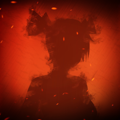

# fiery-look
### Version KitsuDance 1.2.5

## Links
[RedHead Team's VKontakte Group](https://vk.com/redhead_team "Огненный Взгляд || RedHead Team")   
[k1tsukendo's Telegram](https://t.me/k1tsukendo "k1tsukendo`s Telegram")   
[Original repo](https://github.com/Mikan-DS/LookWithFire_Mod "Mikan-DS/LookWithFire_Mod")   
[Developer's VKontakte page](https://vk.com/mikansei_no_zumen "Mikan Jr")   

### Eng

This is a fork of "fiery look" - mod for Everlasting Summer by Redhead Team.   
Forked by k1tsukendo.   
 
**Name : flew - fiery look: extended, wiped**   

This modification is wholly owned by the "RedHead Team".   
I, k1tsukendo, have no serious relationship with the "RedHead" Team.   
This version was created in order to remove a huge amount of garbage from code and create missing menu items.   
 
All work was carried out with the permission of the active teamleader of the "RedHead Team" Vladislav Shorokhov.   

#### Q/A
* **What is that?**
	* This is a fork of mod for "*Everlasting Summer*" called "*Fiery Look*".
	* Im k1tsukendo, leader of fork.
* **Why mod forked?**
	* Because stock version's code is really bad.
	* Also, im Redhead Team's companion and working on menu.
* **Where can i contact with team?**
	* Links please.

### Rus
Этот репозиторий - форк модификации к игре "Бесконечное Лето", "Огненный Взгляд", созданный "RedHead Team".   
Форк создан мной, k1tsukendo.   
 
Эта модификация целиком и полностью принадлежит "RedHead Team".   
К команде "RedHead Team" я, k1tsukendo, серьёзного отношения не имею.   
Эта версия была создана в целях очистки кода от громадного количества мусора и создания недостающих пунктов меню.   

Вся работа проведена с разрешения действующего лидера команды "RedHead Team" Владислава Шорохова.

#### В / О
* **Что это?**
	* Это форк модификации для игры "*Бесконечное Лето*", названной "*Огненный Взгляд*".
	* Я k1tsukendo, ведущая форка.
* **Почему был создан форк?**
	* Потому что код стоковой версии действительно плохой.
	* Также потому, что я - компаньон Redhead Team и работаю над меню.
* **Где я могу связаться с командой?**
	* Посмотрите параграф Links, пожалуйста.
